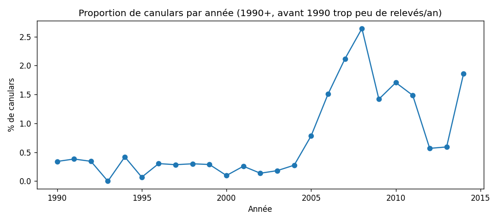

# RAPPORT.md — Bureau d'Analyse Terrestre

## Phase 1 : ouvrir la caisse

L'URL du sujet avait une coquille (tiret manquant), j'ai téléchargé le bon fichier depuis le repo.

- Lignes dans le fichier : 88 875
- Lignes chargées (11 champs) : 88 679
- Lignes écartées (≠ 11 champs) : 196

88 679 + 196 = 88 875, rien n'est perdu.

Les 196 lignes de côté ont 12 champs au lieu de 11 : une virgule en trop quelque part avant le
commentaire, qui décale tout le reste. Ça ne tombe pas toujours au même endroit dans la ligne,
donc impossible de deviner comment recoller les champs sans risquer de mettre une ville dans la
colonne pays. Je les mets de côté pour l'instant.

## Phase 2 : rien n'est du bon type

Conversion en nombres (duration_seconds, latitude, longitude) et en dates (datetime, date_posted).
Aucune ligne supprimée, les valeurs qui résistent deviennent `None`.

- duration_seconds : 5 échecs (2 vides, 3 avec un backtick collé, ex `2\``) — bug du service qui
  convertit le texte libre du témoin en secondes.
- latitude : 1 échec, `33q.200088` — une lettre parasite qui suffit à casser toute la colonne.
  Vient du géocodage/transmission.
- longitude : 0 échec.
- datetime : 1220 échecs, tous en `... 24:00` (ex `10/10/2005 24:00`) — heure invalide, bug du
  service de standardisation, pas le témoin.
- date_posted : 0 échec.

## Phase 3 : trier les canulars

Règle : un relevé est un canular si le mot "hoax" apparaît dans comments.
802 relevés marqués (0,90 % des 88 679).

Limite : la plupart de ces mentions ("possible hoax??", 674 sur 802) sont des notes NUFORC pas
sûres d'elles, pas des canulars confirmés. Et au moins une ligne dit littéralement "No Hoax" dans
le commentaire — la règle l'attrape quand même à tort, elle ne gère pas la négation.

## Phase 4 : le premier verdict

Régression logistique (shape, state, country, duration_seconds, latitude, longitude, comments en
TF-IDF). Évalué sur 17 736 relevés (20 % du jeu, jamais vus à l'entraînement).

- Rappel : 99,4 / 100 canulars réellement présents attrapés
- Précision : 99,4 / 100 signalés qui le sont vraiment

C'est presque trop beau — logique, comments contient littéralement le mot "hoax" qui a servi à
fabriquer l'étiquette en phase 3. À creuser en phase 5.

## Phase 5 : le Conseil ne vous croit pas

| Colonne | Qui écrit | Quand | Savait déjà si canular ? |
|---|---|---|---|
| shape | témoin | le soir même | Non |
| state | témoin | le soir même | Non |
| country | témoin | le soir même | Non |
| duration_seconds | service (calculé depuis le texte du témoin) | à la transmission | Non |
| latitude | service (géocodage) | à la transmission | Non |
| longitude | service (géocodage) | à la transmission | Non |
| comments | témoin, puis employé du Bureau (notes "((NUFORC Note...))") | soir même, puis des semaines plus tard | **Oui** |

comments sort du modèle : c'est là-dedans que l'employé note ses doutes sur un canular des
semaines après coup, et c'est littéralement le champ dont on a tiré l'étiquette en phase 3.

Avant / après (même modèle, sans comments) :
- Rappel : 99,4 → 50,6 / 100
- Précision : 99,4 → 1,1 / 100

L'écart s'explique : le premier chiffre trichait, il avait accès au mot qui a servi à fabriquer
l'étiquette elle-même. Sans lui, le modèle n'a plus que des colonnes que le témoin ou le service
remplissent avant de savoir quoi que ce soit sur un canular, et ça tombe autour du hasard.

## Phase 6 : le modèle le plus bête du Bureau

- Stagiaire ("jamais canular") : 99,1 % de bonnes réponses
- Notre modèle (sans comments) : 59,5 % de bonnes réponses

Le stagiaire gagne sur l'exactitude, et pourtant son système est inutile : il rate 100 % des
canulars puisqu'il n'en signale jamais. L'exactitude est trompeuse ici parce que les canulars sont
rares (0,9 %) — prédire "non" tout le temps suffit à avoir raison presque toujours sans rien
détecter. La mesure qui compte, c'est le rappel (et la précision) : c'est elle qui dit si le
système attrape vraiment des canulars, ce que l'exactitude ne dit pas.

# Le Conseil renvoie le rapport

## Phase 7 : plusieurs témoins, un seul événement

Un événement = même jour + même ville + même state (colonnes `datetime` tronqué au jour, `city`,
`state`). Pour grouper par jour il fallait d'abord réparer les 1220 heures `24:00` laissées à
`None` en phase 2 (24:00 = minuit le lendemain) — sans ça il manquait la date de 1220 lignes.

- Événements avec plus d'un témoin : 2399
- Le plus gros : 56 témoins, le 31 octobre 2004 à Tinley Park (IL)
- Relevés à cheval sur les deux côtés dans la découpe d'hier (aléatoire) : 2051 — soit le modèle
  apprenait une partie d'un événement et se faisait noter sur le reste du même événement.
- Témoignages recopiés mot pour mot (≥40 caractères, pour ignorer les phrases courtes du genre
  "Fireball" qui se répètent par coïncidence) : 139 lignes sur 62 textes distincts. Je les fonds
  dans le même groupe que l'événement concerné, pour la même raison : qu'ils partent ensemble.

Nouvelle découpe : tous les relevés d'un même groupe (événement + doublons fondus) partent du même
côté (`GroupShuffleSplit`).

Rappel / précision du modèle honnête (sans comments), avant → après cette découpe :
- Rappel : 50,6 → 51,9 / 100
- Précision : 1,1 → 1,1 / 100

Ça bouge à peine. Logique : la vraie fuite grave (comments) est déjà partie en phase 5. Ce qui
reste (shape, state, country, duration, lat/long) ne permet pas de "reconnaître" un événement par
cœur de la même manière — un témoin de Tinley Park et un autre écrivent des durées et des formes
différentes même pour le même objet dans le ciel.

## Phase 8 : l'ordre des choses

Coupure sur `datetime` (l'instant où le témoin lève les yeux), pas `date_posted` (quand le Bureau
reçoit/traite le dossier) : 8836 relevés ont plus de 10 ans d'écart entre les deux (jusqu'à
96 ans), donc `date_posted` mélangerait des dossiers anciens traités tard avec des dossiers
récents. Seul `datetime` respecte l'ordre réel des événements.

Découpe par événement (jour+ville+state de la phase 7, pas la fusion par témoignage recopié —
ces doublons peuvent être à des décennies d'écart et casseraient l'ordre chronologique ; sans
conséquence puisque comments est déjà hors du modèle).

- Date de coupure : 11 janvier 2012 (apprentissage = avant, test = à partir de là)
- Relevés : 70 944 en apprentissage, 17 735 en test
- Proportion de canulars — apprentissage : 0,94 % | test : 0,76 %
- Rappel : 51,9 / 100 — Précision : 1,1 / 100

Les deux proportions ne sont pas égales, et ça raconte quelque chose : le taux de canulars (tel
qu'on le mesure, via les notes NUFORC) grimpe fort entre 2005 et 2008 (jusqu'à 2,5 %/an) puis
redescend vers 2012-2013 (~0,5-0,6 %). Ce n'est probablement pas que les gens mentent plus ou
moins selon les années — c'est que les éditeurs NUFORC ont annoté plus ou moins activement
"possible hoax" selon les périodes. Notre étiquette de la phase 3 porte la trace des habitudes du
Bureau, pas seulement des faits.

## Phase 9 : les cases vides

Trois colonnes les plus trouées, canular selon trou ou pas :

| Colonne | Trous | % canular si troué | % canular si rempli |
|---|---|---|---|
| country | 12 365 | 1,16 % | 0,86 % |
| state | 7 409 | 1,30 % | 0,87 % |
| duration_hours_min | 3 017 | 2,35 % | 0,85 % |

Dans les trois cas, un trou est associé à plus de canulars que la moyenne (jusqu'à x2,8 pour
duration_hours_min). Le trou porte de l'info, donc pas question de le boucher sans laisser de
trace.

Traitement retenu : les trous de country et state (déjà utilisées par le modèle) partent dans leur
propre catégorie "inconnu" plutôt que d'être fondus avec une valeur existante — corrigé au passage
un bug silencieux où mon `fillna` ne visait que les `NaN` alors que ces trous sont des chaînes
vides dans le fichier, donc il ne faisait rien. Le one-hot donne sa colonne à "inconnu", le modèle
peut donc toujours distinguer un trou d'une vraie valeur et apprendre la corrélation avec canular.
duration_hours_min n'est pas encore une feature ; même principe prévu quand elle sera traitée en
phase 11.

## Phase 10 : la chaîne de traitement du Bureau

Jusqu'ici, `entrainer_et_evaluer` faisait `df[c].fillna(df[c].median())` sur tout le tableau
*avant* de couper train/test — la médiane (et le remplissage catégoriel) voyait donc une miette du
test. Nouveau `construire_pipeline` : tout ce qui s'apprend (médiane, catégories vues) est dans un
`sklearn.Pipeline`, appris uniquement par `.fit(X_train, ...)`.

Rappel / précision, découpe de la phase 8, avant → après :
- Rappel : 51,9 → 53,3 / 100
- Précision : 1,1 → 1,1 / 100

Ça bouge à peine, et c'est cohérent : à ce stade il y a très peu de valeurs manquantes numériques
(6 au total) et peu de catégories, donc la médiane "propre" et la médiane "sale" sont presque la
même valeur. Le vrai risque de fuite grossira en phase 12 avec l'encodage des villes (une liste
apprise depuis les données) — c'est pour ça qu'on corrige la mécanique maintenant, avant d'ajouter
des features qui ont vraiment besoin d'être apprises sur l'apprentissage seul.

Deuxième point : à 0,9 % de canulars une découpe malchanceuse pourrait donner un test presque vide
en canulars. Déjà vérifié en phase 8 : apprentissage 0,94 %, test 0,76 %, aucun des deux n'est
proche de zéro.

Démonstration : un relevé inventé à la main (`shape=triangle, state=il, country=us,
duration_seconds=300, latitude=41.57, longitude=-87.78`) traverse toute la chaîne en un seul appel
`pipeline.predict(...)` et ressort avec une prédiction, sans retaper une étape à la main.

## Phase 11 : combien de temps ça a duré

Trois durées les plus longues telles quelles dans duration_seconds : 31 ans, 23000hrs (~2,6 ans),
21 ans. Clairement pas des durées d'observation. Décision : au-delà d'un an, une valeur de
duration_seconds n'est plus crédible — 6 relevés dans ce cas, mis de côté plutôt que gardés (sinon
ils écrasent silencieusement toute médiane calculée dessus).

Reconstruction d'une durée utilisable (`duree_s`) : je fais confiance à duration_seconds quand il
est non nul et crédible (≤ 1 an) ; sinon j'essaie de lire duration_hours_min (regex sur secondes/
minutes/heures/jours, plages "X-Y unité", horloge "mm:ss") ; sinon la durée reste inutilisable.

- Relevés dont la durée reste inutilisable après traitement : 7 022 (sur 88 679)
- Colonnes qui se contredisent (facteur > 3 entre les deux) : 734
- Durée médiane : 180 s (3 minutes)
- Relevés annonçant plus d'une journée d'observation : 187

Exemple de contradiction : le 10/10/1956 à Edna, `duration_seconds` dit 20 secondes,
`duration_hours_min` dit "1/2 hour" (1800 s) — écart x90. Je garde `duration_seconds` par défaut
dans ce cas (règle : je ne fais confiance au texte que si le nombre est absent ou à 0), donc cette
ligne précise reste probablement fausse ; c'est une limite connue, pas cachée.

Rappel / précision (duration_seconds → duree_s comme feature) :
- Rappel : 53,3 → 54,1 / 100
- Précision : 1,1 → 1,1 / 100

Aucune ligne perdue (88 679 avant, 88 679 après).

## Phase 12 : la ville et l'heure

- Villes distinctes dans la transmission : 22 018, dont 14 177 (64 %) qui n'apparaissent qu'une
  seule fois.
- Règle ville : gardée en catégorie si vue au moins 20 fois **dans l'apprentissage seul** (appris
  au `.fit()`, jamais avant) — 550 villes gardées, tout le reste devient "autre".
- Colonnes du tableau : 108 (sans ville/heure) → 659 (avec). Loin des 22 018 qu'un one-hot naïf
  sur city aurait coûté.
- Heure encodée en sin/cos plutôt qu'un simple 0-23 : distance encodée 23h↔0h = 0,261, 23h↔20h =
  0,765 — 23h est bien plus proche de minuit que de 20h, comme dans le ciel.
- Formes : 29 → 27 après fusion de deux paires de la même forme sous deux graphies :
  `changed`→`changing` (typo évidente, 1 occurrence) et `round`→`circle` (2 occurrences, jugement
  plus discutable mais les deux ne pèsent presque rien sur le modèle).

Rappel / précision (avec ville + heure + formes fusionnées) :
- Rappel : 54,1 → 48,9 / 100
- Précision : 1,1 → 1,2 / 100

Le rappel baisse un peu, la précision monte un peu : le modèle devient plus prudent — sans doute
parce que 550 villes fraîchement encodées ajoutent du bruit sur un jeu encore minuscule de vrais
canulars (moins de 700 dans l'apprentissage). Pas une régression franche, plutôt un signal que ce
modèle-ci a besoin de plus de canulars pour vraiment apprendre quelque chose de la ville.

# Résumé : comment les deux nombres ont bougé

| Étape | Rappel | Précision | Ce qui a changé |
|---|---|---|---|
| Phase 4 (avec comments, découpe aléatoire) | 99,4 | 99,4 | Le chiffre trichait : comments contient le mot qui a servi à fabriquer l'étiquette |
| Phase 5 (comments retiré) | 50,6 | 1,1 | Fuite corrigée : chiffre honnête, mais nettement moins impressionnant |
| Phase 7 (découpe groupée par événement) | 51,9 | 1,1 | Corrige la fuite d'un même événement partagé entre train et test — bouge à peine ici |
| Phase 8 (découpe chronologique) | 51,9 | 1,1 | Même modèle, découpe dans l'ordre du temps plutôt qu'au hasard |
| Phase 10 (pipeline sans fuite de calcul) | 53,3 | 1,1 | Médiane/catégories apprises sur l'apprentissage seul, pas tout le tableau |
| Phase 11 (duree_s au lieu de duration_seconds) | 54,1 | 1,1 | Récupère ~4 000 durées que la colonne "propre" avait mises à 0 |
| Phase 12 (ville + heure + formes fusionnées) | 48,9 | 1,2 | Plus de features, modèle plus prudent : rappel en baisse, précision en hausse |

Le chiffre de la phase 4 (99,4/99,4) était une fuite de bout en bout. Le chiffre honnête tourne
autour de 50/1 : on attrape environ un canular sur deux, au prix de beaucoup de fausses alertes —
logique avec une cible fabriquée à partir d'un mot-clé dans un texte qu'on a retiré du modèle.

# Défendre une décision

## Phase 13 : la facture du Bureau

Grille votée : 30 crédits par canular manqué, 2 par fausse alerte. Facture calculée sur la partie
test pour chaque frontière de 0.00 à 1.00 (pas de 0,01).

- Optimum strict : frontière 1.00 → 4 050 crédits. Ça revient à ne jamais rien signaler.
- Meilleure frontière qui attrape encore au moins un vrai canular : **0.86 → 4 084 crédits** (3
  canulars attrapés sur 135).
- Frontière à 0.5 (le défaut de la bibliothèque) : 12 540 crédits.
- Écart retenue vs 0.5 : **8 456 crédits économisés**.

Je retiens 0.86, pas l'optimum strict à 1.00 : un système qui ne signale jamais rien n'est pas une
décision qu'on peut présenter au Conseil, et l'écart de coût entre les deux (34 crédits sur toute
la partie test) est dérisoire. Le vrai enseignement est ailleurs : avec la précision actuelle
(~1 %), signaler quoi que ce soit coûte presque toujours plus cher en fausses alertes que ça ne
rapporte en canulars attrapés. Le système n'est pas assez précis pour être rentable en l'état.

## Phase 14 : une promesse à 80 %

Dix tranches de probabilité, ~1770 relevés chacune. Avant calibration, la probabilité annoncée va
de 9 % à 72 % selon la tranche — mais la proportion réelle de canulars reste plate entre 0,3 % et
1,3 % partout. **Le système est trop confiant**, dans des proportions énormes : il dit 72 % là où
la réalité est 1,2 %.

Calibration isotonic apprise par validation croisée sur l'apprentissage (jamais sur le test).
Après coup, la probabilité moyenne annoncée par tranche colle à la proportion réelle (ex. dernière
tranche : 1,44 % annoncé contre 1,54 % observé), et l'ordre des tranches reste cohérent — le
classement du modèle était bon, seul le chiffre affiché était fantaisiste.

## Phase 15 : deux analystes, deux chiffres

- Taille de la partie test : 17 735 — canulars réellement présents : **135**.
- Rappel : 49,0 % [40,2 — 57,7] sur 1 000 rééchantillonnages (bootstrap, graine fixée).
- Précision : 1,2 % [1,0 — 1,6].

Réponse au Conseil : avec seulement 135 canulars dans le test, la fourchette du rappel fait à elle
seule 18 points de large. 0,31 et 0,34 tiennent largement dans ce bruit — les deux systèmes ne sont
pas distinguables sur ce chiffre, il faudrait un tout autre volume de test pour trancher.

## Phase 16 : trois dossiers sur le bureau

Frontière utilisée : 0,86 (phase 13).

**Relevé #7715** (Oklahoma, 07/10/2013) — signalé à 100 % de confiance, **et c'est faux** (pas un
canular). Ce qui bascule : `duree_s` à lui seul (contribution +10,46) — cette ligne a une durée de
10 526 400 s (~4 mois). `duree_s` n'est pas standardisé dans le modèle : une durée extrême écrase
tout le reste du calcul.

**Relevé #75051** (Virginia Beach, 19/08/2013) — juste au-dessus de la frontière (0,860), et c'est
aussi une fausse alerte. `shape=egg` pousse fort vers canular, mais rien ne le confirme ailleurs.

**Relevé #27841** (Greenwood, 07/01/2013) — canular laissé passer (proba 0,856, sous la frontière
de peu). Même `shape=egg` que le cas précédent, mais `country=us` tire vers le bas et le fait
passer sous 0,86 — à un cheveu près.

Importance globale (mélanger une colonne, regarder la chute du rappel de base 48,9) :

| Colonne | Chute de rappel |
|---|---|
| shape | +11,3 pts |
| datetime | +7,0 pts |
| state | +6,7 pts |
| country | +5,5 pts |
| city | +4,0 pts |
| duree_s | +0,0 pt |
| longitude | +0,0 pt |
| latitude | -0,4 pt |

Colonne surprenante : **duree_s**, avant-dernière au classement global — alors qu'elle décide à
elle seule le dossier #7715 ci-dessus. Explication : son poids n'existe que pour une poignée de
durées extrêmes (des mois entiers), invisible en moyenne sur l'ensemble du test. Une explication
de dossier et une explication d'ensemble ne racontent donc pas la même histoire, exactement comme
prévenu — ici, c'est aussi un défaut de méthode (`duree_s` mériterait d'être mise à l'échelle).

## Phase 17 : l'angle mort du Bureau

79,3 % des relevés viennent des États-Unis.

| Zone | n (test) | % canular | Rappel | Précision |
|---|---|---|---|---|
| us | 15 108 | 0,68 % | 0 % | 0 % |
| inconnu | 1 818 | 1,10 % | 0 % | 0 % |
| ca | 566 | 0,71 % | 0 % | 0 % |
| gb | 159 | 3,77 % | 50 % | 75 % |
| au | 69 | 1,45 % | 0 % | 0 % |
| de | 15 | 6,67 % | 0 % | 0 % |

Les trois seuls canulars attrapés dans tout le test sont **tous les trois au Royaume-Uni**. Le taux
de canulars réel est 5 à 10 fois plus élevé hors des États-Unis (jusqu'à 6,67 % en Allemagne contre
0,68 % aux USA) — mais chaque zone hors US pèse entre 15 et 566 relevés en test, bien trop peu
(phase 15) pour en tirer une frontière fiable propre à chaque zone.

Décision : une seule frontière pour tout le monde, faute de volume suffisant ailleurs qu'aux USA.
Mais le taux de canulars nettement plus élevé hors US mérite d'être creusé — soit le Bureau y est
vraiment plus la cible de canulars, soit les habitudes d'annotation NUFORC diffèrent aussi par
pays (même limite qu'en phase 8, mais sur la géographie plutôt que le temps).

## Phase 18 : la transmission d'archive

La courbe confirme et précise la phase 8 : quasi plate et basse jusqu'en 2004 (~0,1-0,4 %), montée
brutale 2005-2008 (jusqu'à 2,64 %), rechute 2012-2013 (~0,6 %), puis remontée en 2014. Ce n'est pas
un phénomène qui évolue doucement, ce sont des marches — cohérent avec des habitudes d'annotation
du Bureau qui changent par à-coups, pas avec une réalité du monde qui dérive en douceur.

Épreuve (entraînement sur l'ancien, test sur le récent — même découpe que la phase 8) :
- Phase 8 (sans ville/heure) : rappel 51,9 — précision 1,1
- Phase 12 (modèle final) : rappel 48,9 — précision 1,2

Les deux modèles tiennent à peu près pareil sur cette découpe ancien→récent : pas d'effondrement
franc, mais les deux nombres restent dans la même zone flottante que la phase 15.

**Surveillance sans connaître la vérité** (la réponse "canular ou pas" arrive des semaines plus
tard, ou jamais) :
1. Taux de signalement du système (% de relevés marqués canular) par semaine.
2. Probabilité moyenne annoncée par semaine, après calibration (phase 14).
3. Taux de country/state manquants par semaine — une dérive des données en entrée précède souvent
   une dérive du modèle.

Fréquence : hebdomadaire. Seuil d'alerte : écart de plus de 3 points de pourcentage vs la moyenne
des 8 semaines précédentes sur l'indicateur 1 ou 3 → on rappelle les analystes. Aucun des trois
n'a besoin de savoir si un relevé était vraiment un canular.

